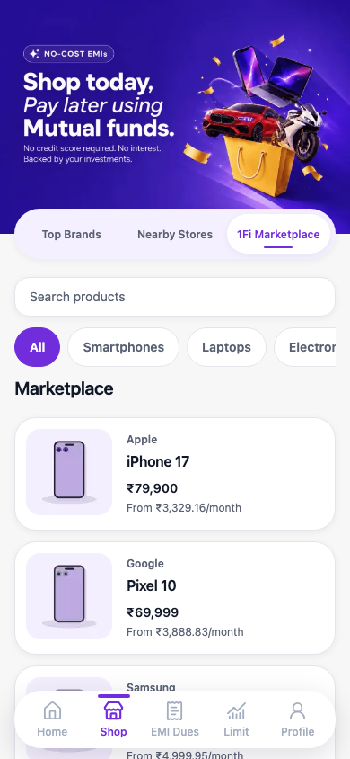
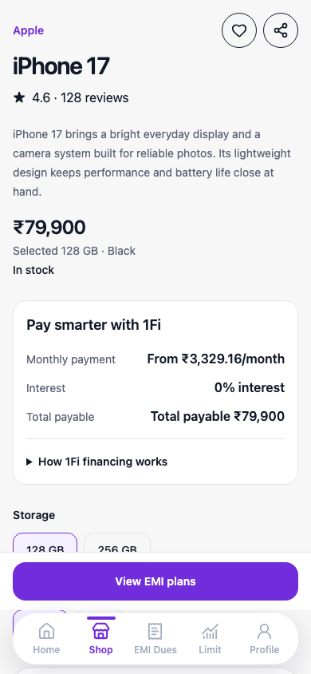
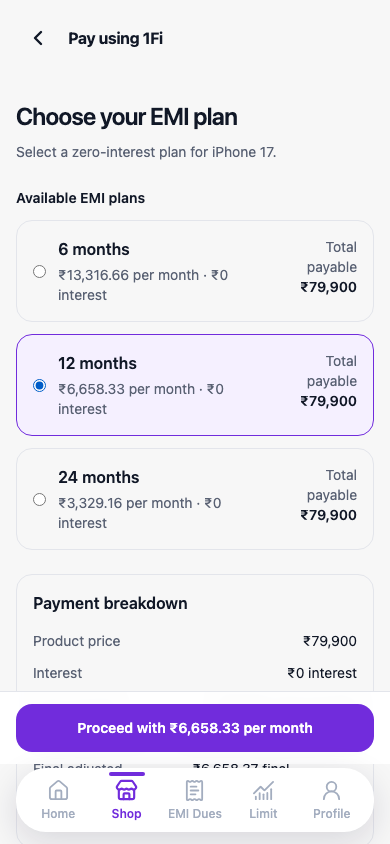
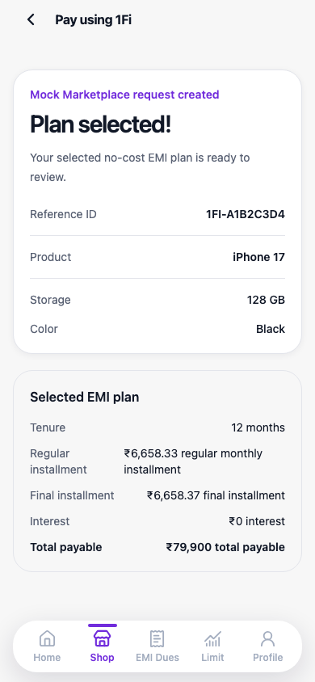

# 1Fi Marketplace - SDE Intern Assignment

## Live Demo

No deployment is included with this assignment. Review the local demo by following the commands below.

## Overview

This independent frontend assignment presents a mobile-first 1Fi Marketplace experience for browsing products and selecting a no-cost EMI plan. It is not connected to 1Fi's private codebase.

## Implemented Flow

Open Marketplace, search or filter the catalog, and use deterministic related-product suggestions to continue browsing. Product details include Share and locally saved-product actions, transparent affordability guidance, purchase-confidence facts, and curated demonstration reviews with local Helpful voting. Configure an in-stock product, choose an EMI tenure, and receive a reloadable mock confirmation.

## Screenshots

| Marketplace | Product details | EMI selection | Confirmation |
| --- | --- | --- | --- |
|  |  |  |  |

## Architecture and State Ownership

Next App Router pages provide route composition. Marketplace catalog filters live in the URL, server endpoints validate mock request and response shapes, React Query owns remote-query lifecycle, and product configuration plus the in-progress EMI choice remain local to the product experience.

## Technology Choices

Next.js, React, TypeScript, Tailwind CSS, Zod, TanStack Query, Vitest, Playwright, and axe-core provide the application, validation, and quality layers.

## Mock API Contracts

`GET /api/products` accepts optional `q` and `category` filters and returns deterministic catalog entries. `GET /api/products/:id` returns a validated product or a not-found response. `POST /api/orders` validates product, variant, and tenure before returning a simulated reference and no-cost EMI breakdown.

## Running Locally

```bash
pnpm install
pnpm dev
```

Run tests with:

```bash
pnpm test
pnpm test:e2e
```

Refresh the committed walkthrough captures explicitly with `UPDATE_SCREENSHOTS=1 pnpm test:e2e`.

## Quality Commands

```bash
pnpm lint
pnpm typecheck
pnpm test:coverage
pnpm build
pnpm test:e2e
```

## Accessibility and Responsiveness

The Shop tabs and EMI plans support keyboard operation, controls have accessible names, status and recovery states are announced, and Playwright runs the flow and axe checks at both a 390-pixel mobile viewport and a centered 1280-pixel desktop viewport. The layout keeps a readable one-column catalog and fixed navigation clear of page content.

## Assumptions and Scope Boundaries

Top Brands and Nearby Stores are intentional empty states. Products, recommendations, affordability guidance, purchase-confidence facts, and reviews use local deterministic fixtures; saved products and Helpful votes use browser storage. They do not represent real user activity, lender approval, merchant decisions, inventory, fulfilment, or financial advice. Orders and financial values are simulated, and no personal data is collected. This work is an independent assignment and does not use or depend on 1Fi private code, live services, lending, payment, or order fulfilment systems.

## Asset Provenance

The local hero asset is an assignment-only copy of the public [1Fi Shop banner](https://cdn.1fi.in/banners/shop-page%201536x1024.webp). Product and PWA assets are deterministic original local renders.

## Repository Structure

```text
src/app/                         routes and mock API endpoints
src/features/marketplace/         Marketplace domain, data, hooks, and UI
src/shared/                       shared shell, controls, and utilities
tests/e2e/                        browser-flow and accessibility proof
docs/screenshots/                 submission walkthrough captures
```
